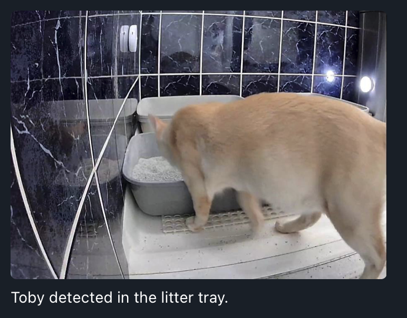

# Cat Detection Notification Server

A YOLOv8-based MQTT motion detection server that monitors Frigate alerts, runs object detection against recent snapshots, and sends annotated notifications to Telegram — including animated GIFs generated from recent frames.

I built this because I had a unwell cat and needed to keep a close eye on his litter tray usage.  Having multiple cats it wasn't always easy to work out who did what.  I now use it as a general notification system to remind me to go and clean the trays and so I know for sure the cats are all using the trays.

---

## Features

* Listens to MQTT motion and object detection events from Frigate.
* Downloads a snapshot from a user-defined URL on motion.
* Runs YOLOv8 object detection on the image.
* Sends a cropped, captioned notification to Telegram if a known cat is detected.
* Generates a short GIF from multiple sequential snapshots to simulate video.
* Avoids repeated alerts with cooldown logic and active cat tracking.

---

## Requirements

* Python 3.10+
* FFMpeg
* A trained YOLOv8 model capable of identifying individual cats.
* A Telegram bot token and chat ID.
* Frigate with MQTT and snapshot API access.
* A camera pointing at the litter tray(s)
* A Linux system or container with systemd (for reliable operation and secret management).

---

## Setup

1. **Clone the repository:**

   ```bash
   git clone https://github.com/neilfx1/cattraydetect.git
   cd cattraydetect
   ```

2. **Install dependencies:**

   ```bash
   pip install -r requirements.txt
   ```

3. **Configure systemd environment variables:**
   Edit your service unit override file:

   ```bash
   sudo systemctl edit detectionserver.service
   ```

   Example variables:

   ```ini
   [Service]
   Environment="MQTT_BROKER=..."
   Environment="MQTT_PORT=8883"
   Environment="MQTT_USER=..."
   Environment="MQTT_PASS=..."
   Environment="TOPIC_MOTION=frigate/CatTrays/motion"
   Environment="TOPIC_CAT=frigate/CatTrays/cat"
   Environment="YOLO_MODEL_PATH=/path/to/your/model.pt"
   Environment="IMAGE_URL=http://cctv.local/CameraName/latest.jpg"
   Environment="SAVE_FOLDER=/tmp/catsnapshots"
   Environment="TEMP_DIR=/tmp/cattray_gif"
   Environment="TELEGRAM_BOT_TOKEN=..."
   Environment="TELEGRAM_CHAT_ID=..."
   Environment="CAT_NAMES=Cat1, Cat2, Cat3"
   ```

4. **Start the service:**

   ```bash
   sudo systemctl daemon-reexec
   sudo systemctl daemon-reload
   sudo systemctl restart detectionserver.service
   ```

---

## Notes

* All secrets and config values are read from the systemd environment.
* The system uses cooldown logic to avoid duplicate alerts.
* The animated GIF is created from cropped stills at the time of motion.  There is a function in the code to swap this to single screenshot only if thats preferred.
* SAVE_FOLDER will retain a copy of the image.  This can be used to train YOLO for your cat(s)
* The output image/gif for Telegram is currently cropped as an example to show it focussing on an area.  You can remove the cropping if desired.
* This was built for my requirements and will likely require some tweaking to work for you.
  
---

## License

MIT — see [LICENSE](LICENSE) for details.

---

## Example Output



---

## Credits

* Inference using [Ultralytics YOLOv8](https://github.com/ultralytics/ultralytics)
* Snapshot input from [Frigate NVR](https://github.com/blakeblackshear/frigate)
